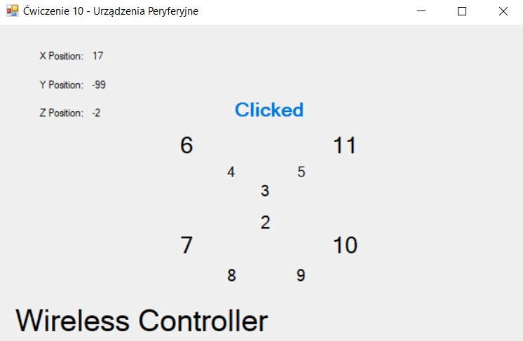

# External Devices
> This repository is a collection of programs that use the functions of external devices.

## Table of contents
* UP_lab10
    * [General info](#general-info)
    * [Screenshots](#screenshots)
    * [Technologies](#technologies)
    * [Setup](#setup)
    * [Status](#status)
* UP_lab12
    * [General info](#general-info1)
    * [Screenshots](#screenshots1)
    * [Technologies](#technologies1)
    * [Setup](#setup1)
    * [Status](#status1)
* UP_lab14
    * [General info](#general-info2)
    * [Screenshots](#screenshots2)
    * [Technologies](#technologies2)
    * [Setup](#setup2)
    * [Status](#status2)
* [Contact](#contact)

# UP_lab10
## General info
Program shows joystick operations and functions in the Windows Form Application. Program was created for the needs of the laboratory in the subject called External Devices. 
The content of the task has been placed [here](http://www.zsk.ict.pwr.wroc.pl/zsk/dyd/intinz/up/lab/lab_10/).

## Screenshots

## Technologies
* C# along with the use in the DirectInput API

## Setup
To use DirectX in your programs it is necessary to install the DirectX SDK. You can download the latest version from the manufacturer's website. Be sure to include the lib headers and libs correctly with the definitions of functions and components in the development environment.

## Status
Project is: _finished_.

## Contact
Created by [@PJasiczek](http://www.piotrjasiczek.pl/) - feel free to contact me!